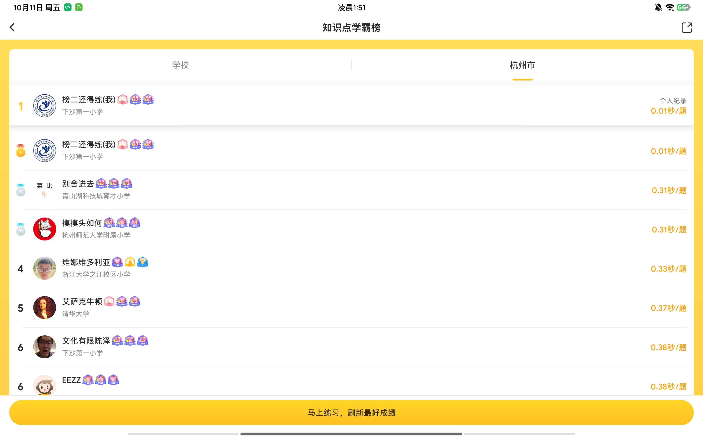
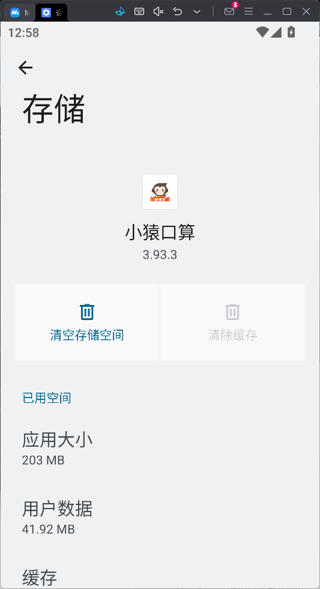

# XiaoYuanKouSuan

`本项目仅供学习和研究使用请于24小时内删除。使用本项目所产生的任何后果由使用者自行承担。在使用本项目之前，请确保您已充分了解相关法律法规，并确保您的行为符合所在国家或地区的法律要求。未经授权的情况下，请勿将本项目用于商业用途或其他非法用途。`

本项目已突破 0.00s

- 方案一： 小猿口算, 采用抓包方式获取题目和答案, 通过 adb 模拟滑动操作 （已失效）
- 方案二： 修改答案为“1”（强烈推荐使用方案二，可 0.00s，仅限练习场）[方案二链接](Change_Answer/README.md)
- 方案三： 修改 pk 场 js 文件（仅限 pk 场）在此特别感谢 [Ulua3809](https://github.com/ulua3809)! [方案三链接](Re_js/README.md)


- [安卓模拟器使用教程](README_EMULATOR.md)

## 战绩可查



在“READY GO”加载出来之前，可在画板滑动，即可达到 0.00s [0.0s 思路见此](https://github.com/xiaou61/XiaoYuanKousuan)

## 目录`以下内容为最原始方案，仅供参考`

- [XiaoYuanKouSuan](#xiaoyuankousuan)
  - [战绩可查](#战绩可查)
  - [目录`以下内容为最原始方案，仅供参考`](#目录以下内容为最原始方案仅供参考)
  - [演示视频](#演示视频)
  - [碎碎念 :thought\_balloon:](#碎碎念-thought_balloon)
  - [环境配置 :hammer\_and\_wrench:](#环境配置-hammer_and_wrench)
  - [代码修改 :pencil2:](#代码修改-pencil2)
  - [使用 :hammer\_and\_wrench:](#使用-hammer_and_wrench)
  - [贡献者 :heart:](#贡献者-heart)
  - [Star History :star:](#star-history-star)

## 演示视频

https://github.com/user-attachments/assets/e9ccfa25-4bdd-4b43-855c-af4a045dcb00

## 碎碎念 :thought_balloon:

代码有点屎山哈哈哈哈，抛砖引玉, 有问题欢迎提 issue :bug:

## 环境配置 :hammer_and_wrench:

1. root 的安卓设备(lsposed 等) :iphone:
2. python3 :snake:
3. adb :electric_plug:

## 代码修改 :pencil2:

```python
def str_to_xy(str):
    match str:
        case "1":
            return [[1480, 1050], [1440, 1470]]
        case "2":
            return [[1255, 1100], [1700, 1100], [1255, 1470], [1700, 1470]]
        case "3":
            return [[1344, 1040], [1600, 1200], [1270, 1323], [1635, 1379], [1249, 1588]]
        case "4":
            return [[1716, 1274],[1245,1296],[1450,1030],[1450,1466]]
        case "5":
            return [[1558,1020],[1290,1211],[160,1348],[1300.1472]]
        case "6":
            return [[1533,1027],[1265,1428],[1663,1439]]
        case ">":
            return [[[1350, 1080], [1545, 1172], [1295, 1297]]]
        case "<":
            return [[[1578,1058],[1308,1231],[1560,1292]]]
        case "=":
            return [[[1284, 1122], [1700, 1122]],[[1280, 1300], [1700, 1300]]]
```

> [!TIP]
> 根据设备分辨率修改坐标（同元组内坐标连续滑动）

```bash
# 查看当前分辨率
adb shell wm size
#还原默认分辨率
adb shell wm size reset
# 更改分辨率为 1800x2880
adb shell wm size 1800x2880
```

```python
def answer_write(answer):

    for i in range(len(answer)):
        number_command.swipe_screen(answer[i])
        # time.sleep(0.16)
        time.sleep(0.3)
```

根据所需更改每个题目间隔时间

## 使用 :hammer_and_wrench:

1. 安装依赖

```shell
pip install -r requirements.txt
```

2. 配置 root 设备

采用 trust me already 禁用 app ssl

3. 配置 adb

- 打开开发者选项中的 usb 调试

```shell
adb devices
```

4. 配置安卓代理

WIFI 设置代理为电脑 ip 和端口(8080)

5. 运行

```shell
python main.py -H <host> -P <port>
```

例如：

```shell
python main.py -H 0.0.0.0 -P 8080
```

6. （方案三）进入设置，清除小猿口算缓存
   
7. （方案三）pk 场中任意答案都会判定正确，使用连点器即可 ps：有人提的 pr 把 adb shell 命令方式改了，有点影响速度，后续会修改，故此次更新不包含模拟点击

## 贡献者 :heart:

感谢以下贡献者对本项目的支持与付出：


<!-- CONTRIBUTORS-START -->

<a href="https://github.com/sd0ric4"></a>
<a href="https://github.com/cr4n5"></a>
<a href="https://github.com/jhy354"></a>
<a href="https://github.com/Fumeng24"></a>
<a href="https://github.com/MultiWolf"></a>
<a href="https://github.com/ulua3809"></a>
<a href="https://github.com/xiaou61"></a>
<a href="https://github.com/GSQZ"></a>

<!-- CONTRIBUTORS-END -->

## Star History :star:

[](https://star-history.com/#cr4n5/XiaoYuanKouSuan&Date)
