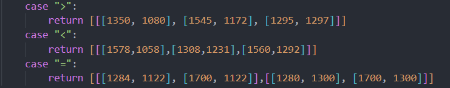

# XiaoYuanKouSuan

方案三

- [IOS设备见此](https://github.com/cr4n5/XiaoYuanKouSuan/issues/91)

## 所需 :hammer_and_wrench:

1. root 的安卓设备，虚拟机也可(lsposed,magisk 等) :iphone:
2. python3(非必须) :snake:
3. adb(非必须) :electric_plug:
4. docker(非必须) :whale:
## 使用 :hammer_and_wrench:

- [安卓模拟器使用教程](README_EMULATOR.md)

[软件及模块](https://xuanrandev.lanzouw.com/b00qc8yij) 密码：5qiw

1. 下载所有需要的软件以及模块，
2. 安装HttpCanary证书模块到Magisk并重启
3. 安装HttpCanary，证书那步安装失败先跳过去。
4. 打开爱玩机工具箱，在导航->应用相关->小黄鸟证书修复中修复小黄鸟证书问题。
5. 打开小黄鸟证书设置，选择添加根证书至系统，这里会申请root权限记得同意。
6. 安装好TrustMeAlready模块并勾选你要抓包的软件。
7. 重启

以上内容来自 酷安@XuanRan_Dev

以下使用方式三选一

### 运用HttpCanary

8. 进入设置，清除小猿口算缓存!!!（多多清除缓存!!!，有许多不成功的原因来自于此）


- 教程视频

https://github.com/cr4n5/XiaoYuanKouSuan/issues/31#issue-2579180244

9. 按照方案二教程视频 找到类似url重放修改为https://leo.fbcontent.cn/bh5/leo-web-oral-pk/exercise_*.js

10.  重放响应body中，采用上传文件的方式，上传仓库中的[exercise.js](/exercise.js)

11.  pk 场中任意答案都会判定正确，使用连点器即可

### 运用python

见[原文档](/README.md)

### 运用docker
安装docker

#### Windows （并不推荐）
```shell
winget install "Docker Desktop"
```

#### 
在 Arch Linux 上安装 Docker 并配置用户组的方法如下：

### 安装 Docker
1. **更新系统包数据库**：
   ```sh
   sudo pacman -Syu
   ```

2. **安装 Docker**：
   ```sh
   sudo pacman -S docker
   ```

### 配置用户组
1. **创建 `docker` 用户组**（如果尚未创建）：
   ```sh
   sudo groupadd docker
   ```

2. **将当前用户添加到 `docker` 组**：
   ```sh
   sudo usermod -aG docker $USER
   ```

3. **重新启动 Docker 服务**：
   ```sh
   sudo systemctl start docker
   sudo systemctl enable docker
   ```

4. **重新登录以使用户组更改生效**：
   - 退出当前会话并重新登录，或者使用以下命令重新加载用户组：
     ```sh
     newgrp docker
     ```

### 验证安装
1. **运行 `hello-world` 容器以验证 Docker 安装**：
   ```sh
   docker run hello-world
   ```

### 更新后的 

README.md

 文件
```markdown
### 运用python

见[原文档](/README.md)

### 运用docker

```shell
# cd 到仓库文件夹 Re_js
cd Re_js
docker build -t xiaoyuan_plan_three .
docker run -d -p 8080:8080 xiaoyuan_plan_three
```


#### Windows 安装docker (并不推荐)
```shell
winget install "Docker Desktop"
```

#### Arch Linux 安装docker
```sh
# 更新系统包数据库
sudo pacman -Syu

# 安装 Docker
sudo pacman -S docker

# 创建 docker 用户组（如果尚未创建）
sudo groupadd docker

# 将当前用户添加到 docker 组
sudo usermod -aG docker $USER

# 重新启动 Docker 服务
sudo systemctl start docker
sudo systemctl enable docker

# 重新登录以使用户组更改生效
newgrp docker

# 验证 Docker 安装
docker run hello-world
```

## Q&A :question:

- 建议使用app version 3.93.2 [详情见](https://github.com/cr4n5/XiaoYuanKouSuan/issues/74)
- 运用HttpCanary时，出现白屏现象即仓库内exercise.js需要更新，可自行运行[getExercise.exe(无需python环境)](/getExercise.exe)进行更新exercise.js
